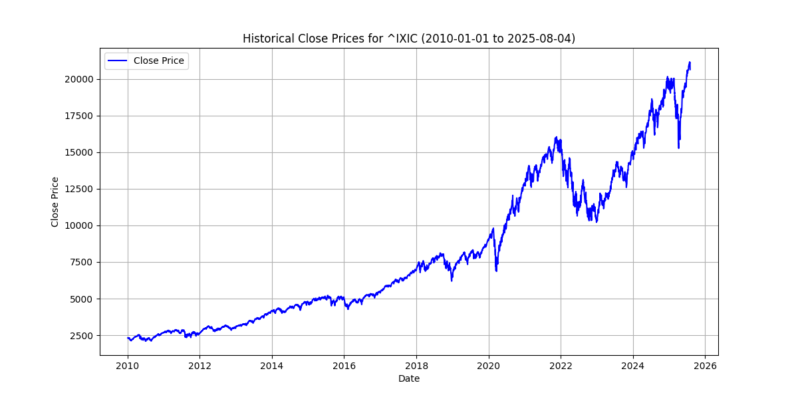
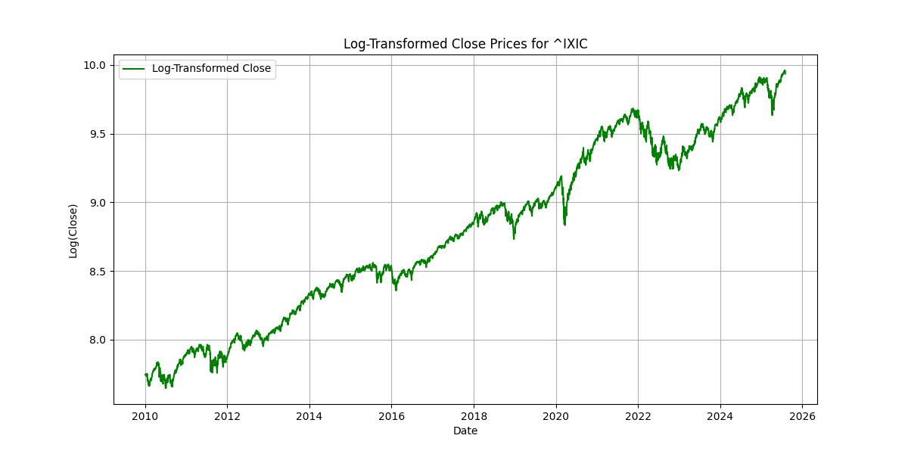
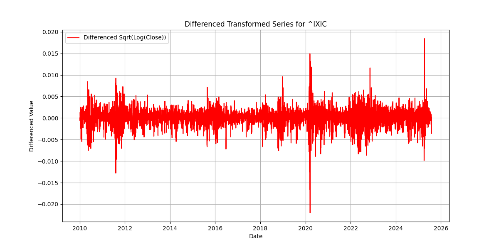

# Stock Data Fetcher from Yahoo Finance

**Aashish Bohra | Senior PhD @ IIT Jodhpur | AI in finance | Stock prediction using DL | Quant analyst & developer | Aspiring quant trader & researcher 🚀**

This repo contains a simple Python script to fetch historical stock data using yfinance, ideal for quant research, trading strategies, and deep learning models for stock prediction.

## Usage
1. Clone the repo:
   ```bash
   git clone https://github.com/quantxaashish/stock-data-fetcher.git
   python stock_data_fetcher.py


This fetches data for NASDAQ (^IXIC), generates plots, and saves a CSV.
Customize the ticker or dates in the code (e.g., change company = 'AAPL').

Example Outputs



Download sample data: historical_close_prices.csv
Why This Matters
These transformations (log, sqrt, differencing) are key for preparing stock data in deep learning models for prediction—part of my research in AI for finance.
